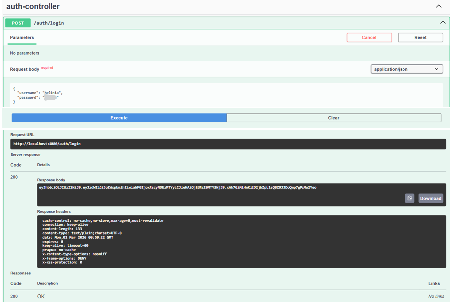
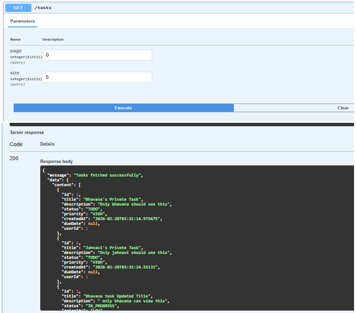
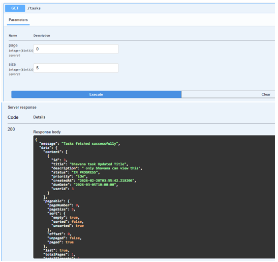
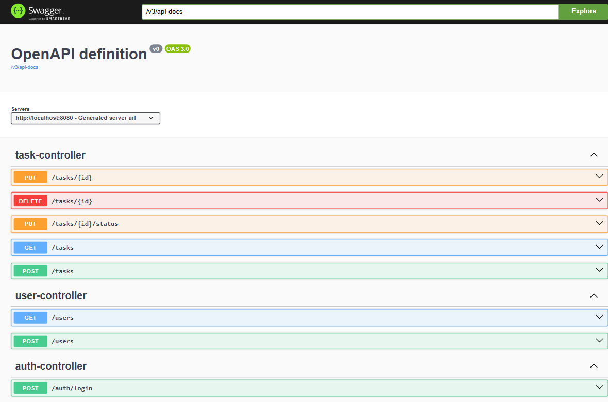

# Task Manager API
Developed a secure Task Management REST API using Spring Boot with JWT-based authentication and role-based access control (ADMIN/USER).
Implemented user-specific task visibility, pagination, soft delete, workflow validation, and DTO-based secure response handling.
Integrated Swagger for API documentation and followed clean layered architecture (Controller–Service–Repository) with MySQL persistence.

## Features

- JWT Authentication
- Role-Based Authorization (ADMIN / USER)
- User-Specific Task Access
- Soft Delete for Tasks
- Pagination Support
- Input Validation using @Valid
- Global Exception Handling
- Swagger API Documentation
- Clean DTO Architecture (No Entity Exposure)


## 🛠 Tech Stack
- Java 21
- Spring Boot 3.3.5
- Spring Security
- JWT (jjwt)
- Spring Data JPA
- MySQL
- Maven
- Swagger (OpenAPI)

## 🔐 Authentication
Login endpoint:

POST /auth/login

After successful login, a JWT token is returned.

Include the token in the Authorization header for secured endpoints:

Authorization: Bearer <your_token>

##  Main Endpoints

Authentication:
- POST /auth/login

Users:
- POST /users
- GET /users

Tasks:
- POST /tasks
- GET /tasks
- PUT /tasks/{id}
- PUT /tasks/{id}/status
- DELETE /tasks/{id}


##  Screenshots

###  Login – JWT Token Response
Shows successful authentication and returned JWT token.




### 📋 User-Specific Task Response
Demonstrates role-based access where users can only view their own tasks. And Admin can see all user's task




---

###  Swagger UI Documentation
Interactive API documentation generated using SpringDoc OpenAPI.




## 📄 Swagger Documentation

After running the application, open:

http://localhost:8080/swagger-ui/index.html

---

## ⚙ How To Run

1️⃣ Clone the repository

```
git clone https://github.com/YOUR_USERNAME/task-manager-api.git
cd task-manager-api
```

2️⃣ Configure database in `application.properties`
spring.datasource.url=jdbc:mysql://localhost:3306/taskdb
spring.datasource.username=your_username
spring.datasource.password=your_password
```

3️⃣ Run the project
mvn clean install
mvn spring-boot:run

4️⃣ Open Swagger
http://localhost:8080/swagger-ui/index.html

## 🏗 Project Structure

- controller  
- service  
- repository  
- model  
- security  
- dto  
- exception  

---

##  Author

Helinia
